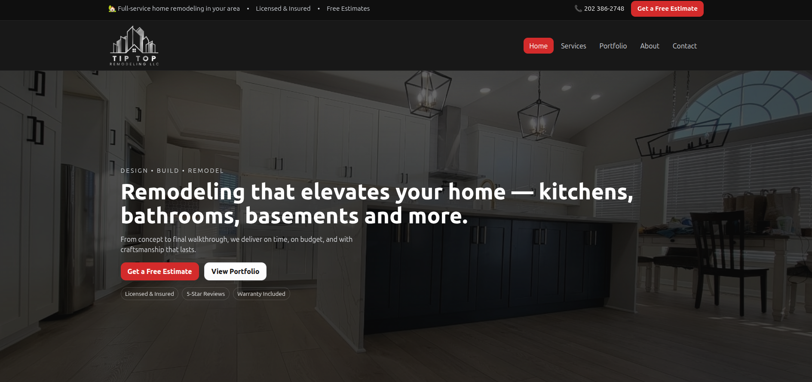
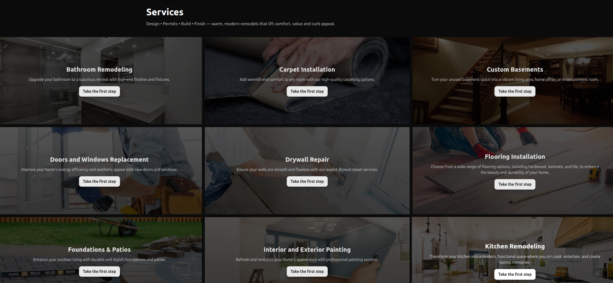
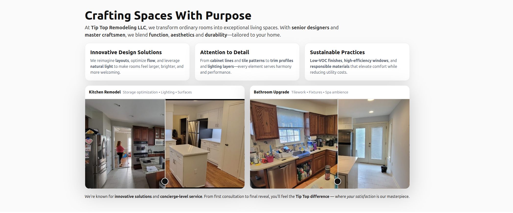
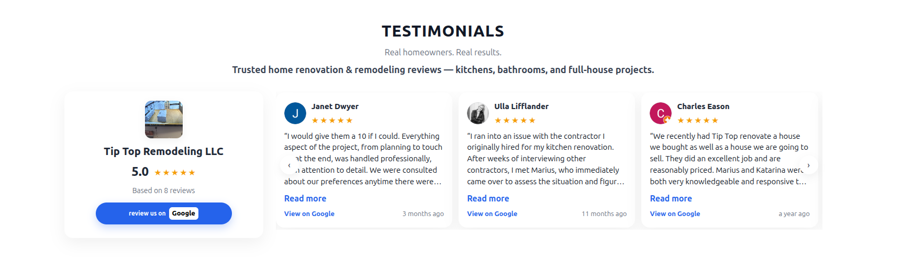
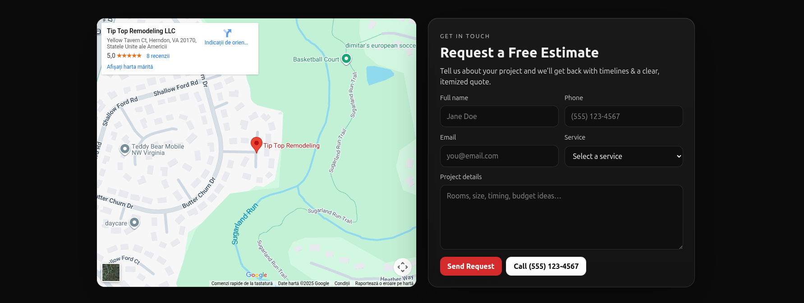
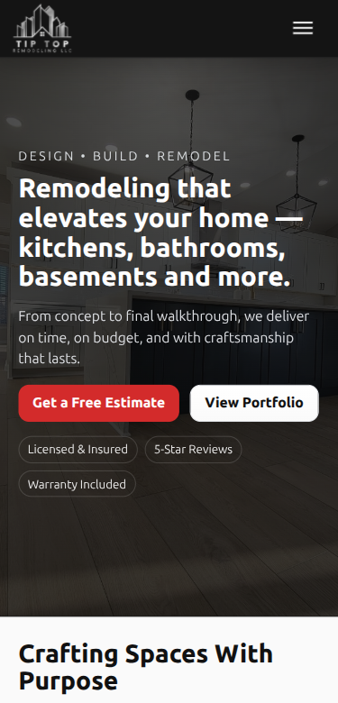

# 🏠 Tip Top Remodeling LLC – Laravel Website

Professional remodeling company website built with **Laravel**, **Blade** & **Vite**

---

## 🔗 Live Demo

Website-ul este live aici:

👉 **https://tiptopremodelingllc.com/**

---

## 📌 Descriere generală

Acest proiect reprezintă website-ul oficial al companiei **Tip Top Remodeling LLC**, o firmă de remodelări rezidențiale din SUA.  
Site-ul este construit cu **Laravel** și oferă o prezentare completă a serviciilor, un portofoliu cu lucrări „before & after”, testimoniale reale și un formular de contact care trimite cererile direct pe email.

Structura este gândită ca un site de prezentare modern, optimizat pentru:

-   generare de lead-uri (formulare, CTA-uri clare)
-   încredere (testimoniale și recenzii Google)
-   SEO (pagini dedicate pentru servicii)
-   UX pe desktop și mobil

---

## 🔧 Funcționalități principale

### 1. Homepage & Hero Section

-   mesaj clar de brand și poziționare
-   butoane de call-to-action („Schedule a Consultation”, „Contact Us”)
-   acces rapid la servicii și testimoniale

### 2. Pagină de Servicii

-   listă detaliată a serviciilor: kitchen/bathroom remodeling, basements, flooring, painting, roofing, patios etc.
-   text optimizat pentru SEO (keywords specifice remodeling)
-   link-uri către secțiuni și contact

### 3. Testimoniale (Google Business Reviews)

-   secțiune de testimoniale cu fotografii și nume reale
-   conținut preluat din profilul de Google Business / Facebook Reviews
-   prezentare orientată pe încredere și reputație

### 4. Our Gallery – Before & After

-   portofoliu cu filtre (All, Kitchens, Bathrooms, Flooring, Additions, Painting, Decks, Siding-Stucco, Windows & Doors)
-   prezentare „Before & After” pentru anumite lucrări
-   imagini mari, optimizate pentru impact vizual

### 5. Contact & Map

-   embed Google Maps cu locația companiei
-   date de contact vizibile: adresă, email, telefon
-   formular de contact care trimite cererile pe email

### 6. Formular de contact cu trimitere pe email

Formularul folosește o rută Laravel (`route('contact.send')`) și trimite datele completate către adresa de email a clientului.

Principalele field-uri:

-   nume complet
-   telefon
-   email
-   serviciu dorit (select box)
-   detalii proiect (textarea)

Fragment de cod (Blade):

```blade
<form class="cm-form" method="POST" action="{{ route('contact.send') }}">
    @csrf
    <!-- name, phone, email, service, message -->
    <button class="btn btn-primary" type="submit">Send Request</button>
</form>
Funcționalitatea de trimitere email este realizată prin Laravel Mail, iar mesajele sunt primite instant indiferent de adresa de email introdusă de client.

Formularul include și:

validare server-side

câmp honeypot (website) pentru protecție anti-spam

mesaje de succes/eroare prin session('status')

## ⚙️ Tehnologii Utilizate

- **Laravel 10+**
- **PHP 8+**
- **Blade Templates** pentru structurarea interfeței
- **Vite** pentru bundling CSS & JS
- **TailwindCSS** + CSS personalizat pentru layout și componente
- **JavaScript (ES6)** pentru interacțiuni și animații
- **Laravel Mail** pentru trimiterea emailurilor din formularul de contact
- **Google Maps Embed** pentru afișarea locației firmei
- **Google Business / Facebook Reviews** pentru integrarea testimonialelor reale

## 📁 Structura Proiectului (Overview)

app/            → logica de business, controllere, mail, model
bootstrap/
config/
database/
public/         → assets publice (imagini, CSS/JS procesate)
resources/
  ├── views/    → Blade templates (home, services, gallery, contact etc.)
  ├── css/      → fișiere CSS sursă
  └── js/       → fișiere JS sursă
routes/
  ├── web.php   → rute publice (home, services, gallery, contact, etc.)
storage/
tests/
vite.config.js
composer.json
package.json


## 🖼️ Screenshots

Mai jos sunt câteva capturi reprezentative din site-ul Tip Top Remodeling LLC, prezentând principalele secțiuni și funcționalități.
Fișierele sunt stocate în folderul `screenshots/`.

---

### 🏠 Homepage Hero (Desktop)



Secțiunea principală a homepage-ului, cu mesaj clar de brand, CTA-uri vizibile și acces rapid către paginile importante.
Structură construită pentru impact vizual și conversie (lead generation).

---

### 🛠 Services Section



Listă completă a serviciilor oferite de companie: kitchen & bathroom remodeling, basements, flooring, painting, roofing, siding, patios etc.
Conținut optimizat SEO, cu structură clară și navigare intuitivă.

---

### 🔄 Before & After Gallery



Portofoliu vizual cu transformări înainte/după, prezentat prin carduri full-width și filtre dinamice (Kitchens, Bathrooms, Flooring, Painting, Additions etc.).
Secțiune orientată către încredere și vizualizarea calității lucrărilor.

---

### ⭐ Testimonials Section



Secțiune cu recenzii reale preluate de pe Google Business / Facebook Reviews, stilizate curat și profesionist.
Ajută la consolidarea credibilității și creșterea ratei de conversie.

---

### 📍 Contact & Map



Formular de contact complet funcțional, integrat cu Laravel Mail — mesajele sunt trimise direct către client.
Include Google Maps Embed, validare server-side, mesaje de eroare/succes și honeypot anti-spam.

---

### 📱 Homepage – Mobile Version



Versiunea mobile a homepage-ului, optimizată cu un layout fluid și un meniu burger pentru navigare ușoară pe ecrane mici.
Întregul site este construit mobile-first, cu breakpoints profesionale.

## 👤 Rol Personal în Proiect

În cadrul acestui proiect am contribuit la:

- designul și implementarea completă a interfeței folosind **Blade** și **CSS personalizat**
- structurarea și optimizarea paginilor pentru **SEO**, incluzând pagini dedicate fiecărui serviciu
- dezvoltarea secțiunii **Before & After** din galerie/portofoliu
- integrarea și stilizarea testimonialelor reale din **Google Business / Facebook Reviews**
- implementarea formularului de contact și integrarea acestuia cu **Laravel Mail** pentru trimiterea automată a cererilor
- realizarea layout-ului **responsive** pentru desktop, tabletă și mobil
- configurarea și **deploy-ul** proiectului pe serverul de producție

```
